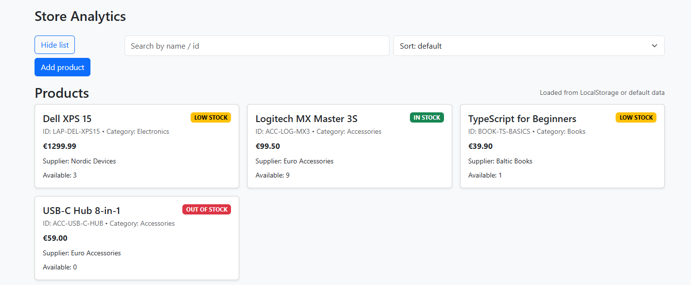
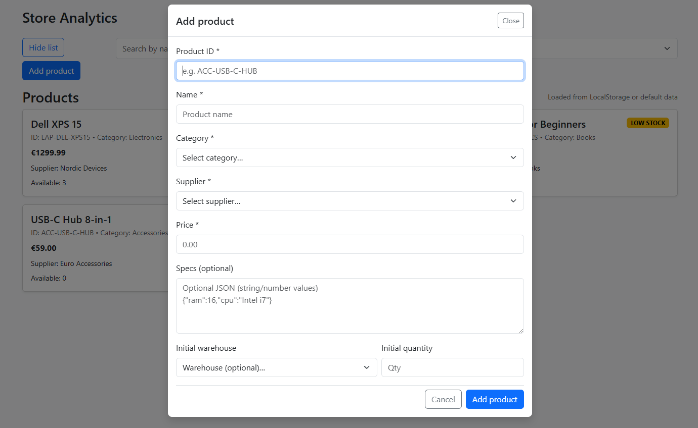

# Store Analytics

## Description

Store Analytics is a TypeScript web application for managing products and stock.

Consists of task 1 - console app (view product list in console of web app), view products and task 2 - web application

Features:
- Display product list
- Add product via modal form
- Validate input and prevent duplicate IDs
- Search by name or ID
- Sort by name, price or availability
- Calculate stock status (IN_STOCK / LOW_STOCK / OUT_OF_STOCK)
- Save data to LocalStorage
- Restore data after page refresh

---

## Screenshot




---

## Project Structure

```
Store-Analytics/
├─ index.html
├─ src/
│  ├─ data/
│  │  ├─ productsData.ts
│  │  └─ models/
│  │     ├─ category.ts
│  │     ├─ discount.ts
│  │     ├─ product.ts
│  │     ├─ review.ts
│  │     ├─ stock.ts
│  │     └─ supplier.ts
│  ├─ task1/
│  │  └─ main.ts
│  └─ task2/
│     ├─ main.ts
│     └─ app/
│        ├─ services/
│        │  ├─ productService.ts
│        │  └─ storage.ts
│        ├─ ui/
│        │  ├─ dom.ts
│        │  ├─ events.ts
│        │  ├─ modal.ts
│        │  └─ render.ts
│        └─ utils/
│           └─ validators.ts
```

## Technologies Used

- **TypeScript** for application logic and type safety
- **Bootstrap** for structure and styling
- **Node.js/npm** for development tooling (TypeScript compiler, local server)
- **LocalStorage API** for persisting product and stock data
- Modern browser APIs (DOM, Fetch etc.)

## Running the Project

Before running project, you need to compile it.
1. Compile TypeScript: npx tsc

To view the web application (task 2), serve the project folder using a static file server. You can choose one of the following methods:

2. **Live Server extension** in VS Code
   - Install the Live Server extension.  
   - Right‑click `index.html` and select **Open with Live Server**.

3. **npx serve** (requires Node.js/npm)
   ```bash
   npm install -g serve           
   npx serve .                   
   ```
   Open `http://localhost:3000` (or the URL shown in the terminal) in your browser.

The interface will display the product list with search, sort, and add‑product modal.  
Data is stored in LocalStorage.

